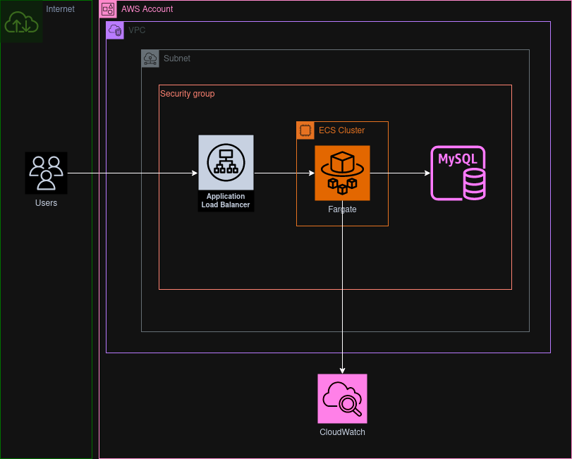

# AWS Wordpress ECS deployment with CDKTF
## Architecture

## Instructions
This deployment uses user Access Keys.
 1. In the secrest and variables Actions menu, place the following key pairs
    1. AWS_ACCESS_KEY_ID: <AWS_ACCESS_KEY_ID>
    2. AWS_SECRET_ACCESS_KEY: <AWS_SECRET_ACCESS_KEY>
    3. DB_USER: <database_user_name>
    4. DB_PASS: <database_password>
    5. VPC_ID: <id_of_vpc>
    6. STATE_BUCKET: <backend_bucket_to_store_state>
    7. SUBNET: <first_subnet>
    8. SUBNET_2: <second_subnet>

2. Verify deployment by:
    1. Follow the deployment at the bmo-iac-cluster on the ECS page.
    2. Copy the DNS name from the loadbalancer page and visit the site in a new tab
    
